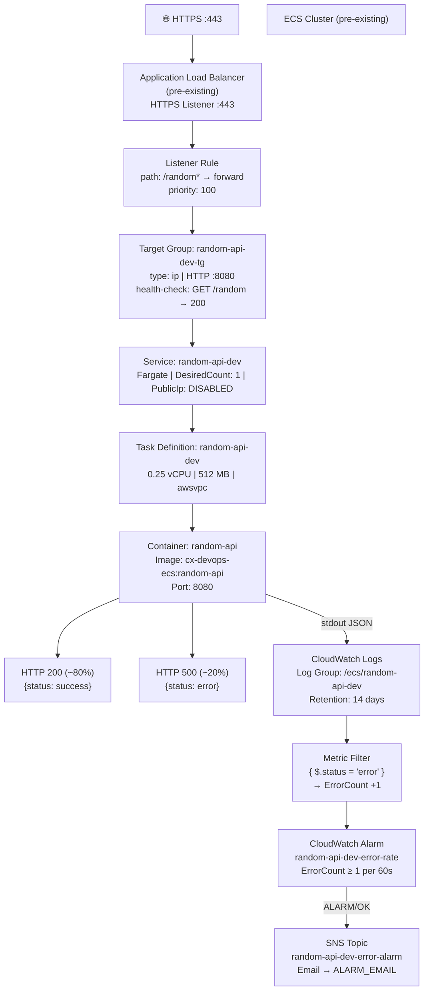

# random-api

> ECS Fargate service with ALB routing, CloudWatch logging, and error alerting

---

## Architecture Overview

## Architecture



---

## ECR Image

> Pre-built — not managed by this pipeline

| Field | Value |
|---|---|
| Repository | `cx-devops-ecs` |
| Image tag | `random-api` |
| Full URI | `<account-id>.dkr.ecr.<region>.amazonaws.com/cx-devops-ecs:random-api` |

The image was built manually on an EC2 instance and pushed to ECR. The GitHub Actions workflow does **not** build or push the image. The full URI is stored as the `ECR_IMAGE_URI` GitHub repo variable and passed to CloudFormation as the `ImageUri` parameter at deploy time.

---

## IAM — Least Privilege

### ECSExecutionRole
Used by the ECS agent (not the container).

- **Principal:** `ecs-tasks.amazonaws.com`
- **Policy:** `AmazonECSTaskExecutionRolePolicy` (AWS managed)
  - `ecr:GetAuthorizationToken`, `ecr:BatchGetImage` — image pull
  - `logs:CreateLogGroup`, `logs:CreateLogStream`, `logs:PutLogEvents` — CloudWatch Logs

### ECSTaskRole
Assumed by the running container.

- **Principal:** `ecs-tasks.amazonaws.com`
- **Inline Policy:** `CloudWatchLogsAccess`
  - `logs:CreateLogStream`
  - `logs:PutLogEvents`
  - **Resource:** `arn:aws:logs:*:*:log-group:/ecs/random-api-dev:*`

---

## CloudFormation Stack Dependency Order

\```
root.yaml  (random-api-root-dev)
│
├── IAMStack   [iam.yaml]  ──────────┐
│   ECSExecutionRole                 │  both complete before ECSStack starts
│   ECSTaskRole                      │  (CF infers via !GetAtt references)
│                                    │
├── ALBStack   [alb.yaml]  ──────────┤
│   RandomTargetGroup                │
│   RandomListenerRule (/random*)    │
│                                    ▼
├── ECSStack   [ecs.yaml]  ───────────────────────┐
│   RandomApiLogGroup                             │  complete before CWStack
│   RandomApiTaskDefinition                       │
│   RandomApiService                              │
│                                                 ▼
└── CWStack    [cw.yaml]
    ErrorAlarmTopic  (SNS)
    ErrorMetricFilter
    ErrorAlarm
\```

---

## GitHub Actions — `build.yml`

Triggered on push to `main`.

> **Note:** Docker build and push are **not** part of this workflow. The image is pre-built in ECR. This pipeline only deploys infrastructure.

| Step | Action |
|---|---|
| 1 | Checkout |
| 2 | Validate CF templates (`cfn validate` — PR + push) |
| 3 | `aws s3 sync random-api/infra/ → s3://devops-cfn-dev/random-api/` |
| 4 | Preflight: delete stack if `ROLLBACK_COMPLETE` |
| 5 | `aws cloudformation deploy` (root.yaml, `CAPABILITY_NAMED_IAM`) — `ImageUri` from `vars.ECR_IMAGE_URI` |
| 6 | Show stack outputs |

### Required GitHub Repo Variables

> Settings → Variables → Actions

| Variable | Description |
|---|---|
| `GIT_RUNNER` | CodeBuild project name |
| `ECS_CLUSTER_ARN` | Pre-existing cluster ARN or name |
| `ECS_SECURITY_GROUP_ID` | Pre-existing SG (allow inbound TCP 8080 from ALB) |
| `PRIVATE_SUBNET_IDS` | `subnet-aaa,subnet-bbb` (comma-separated) |
| `VPC_ID` | Pre-existing VPC ID |
| `ALB_LISTENER_ARN` | Pre-existing HTTPS listener ARN |
| `ALARM_EMAIL` | Email for SNS alarm notifications |
| `ECR_IMAGE_URI` | e.g. `123456789012.dkr.ecr.us-east-1.amazonaws.com/cx-devops-ecs:random-api` |

---

## Resource Summary

### Pre-existing Resources

| Resource |
|---|
| ECS Cluster |
| VPC |
| Private subnets (×2) |
| Security group |
| Application Load Balancer |
| HTTPS Listener (port 443) |
| S3 bucket (`devops-cfn-dev`) |
| ECR repository (`devops-ecs`) + image tag (`random-api`) |
| CodeBuild GitHub runner |
